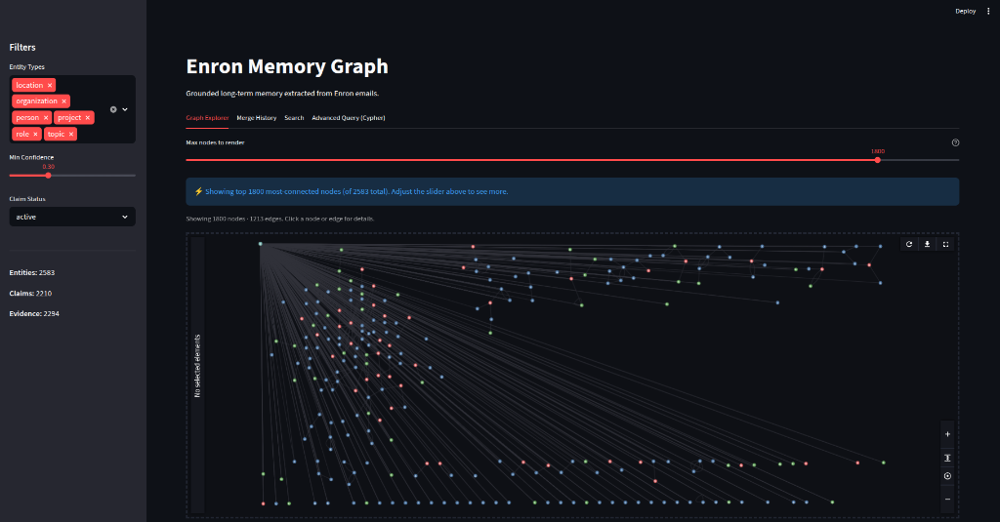
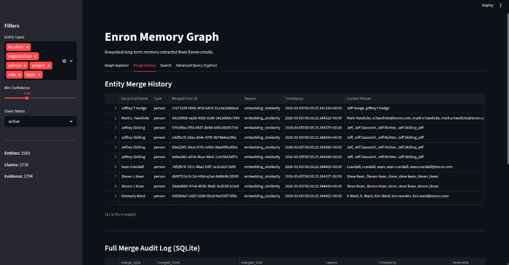
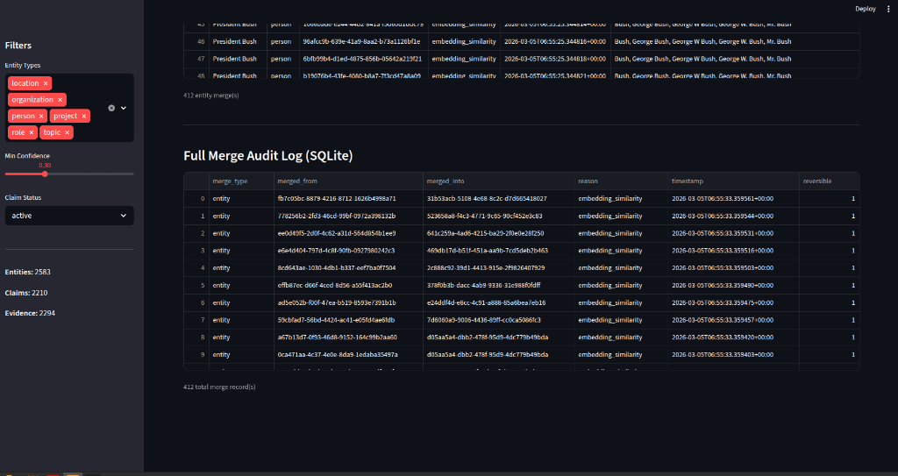
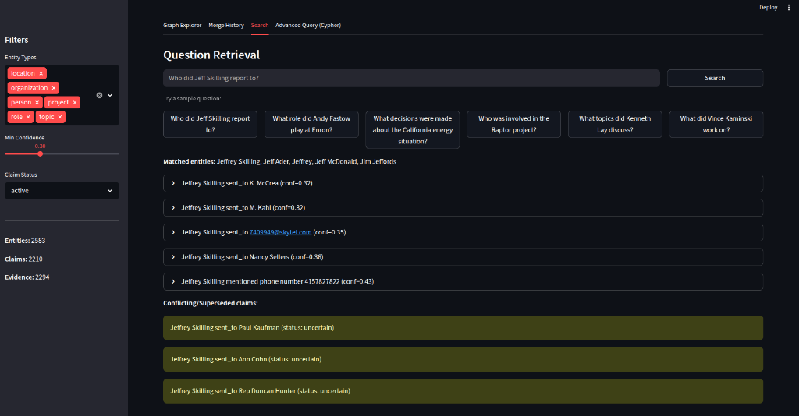
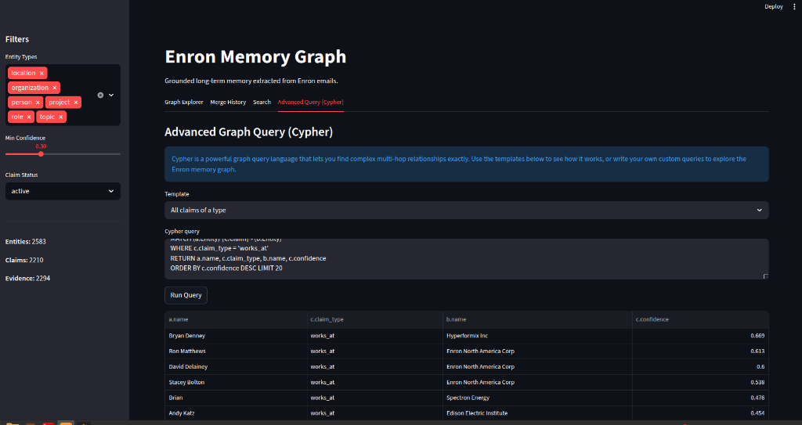

# Grounded Long-Term Memory System

Extracts structured knowledge from the Enron email dataset, deduplicates entities and claims at
three levels, stores them in a grounded memory graph, and provides retrieval with interactive
visualization.

**117/117 tests passing · 2542 entities · 2098 claims · 2196 evidence · 340 merges**

---

## Screenshots

| Graph Explorer | Merge History (Recent) | Merge History (Log) |
|---|---|---|
|  |  |  |

| Search Retrieval | Cypher Query |
|---|---|
|  |  |

> To regenerate: `uv run streamlit run app/app.py` (requires `outputs/` to exist)

---

## Quick Start

```bash
# 0. Prerequisites
#    - Python 3.11+, uv installed (https://docs.astral.sh/uv/)
#    - TrueFoundry API key (or Ollama running locally)
#    - dataset/Enron_emails.csv  (see Dataset section below)

# 1. Install dependencies
uv sync

# 2. Configure API key
cp .env.example .env
# Edit .env: OPENAI_API_KEY=<your-truefoundry-jwt-token>

# 3. Sample corpus (200 emails from 2001)
uv run python -m pipeline.download_corpus --sample-size 200

# 4. Run full extraction + dedup + graph + retrieval pipeline
uv run python main.py --sample-size 200

# 5. Launch interactive UI
uv run streamlit run app/app.py
```

---

## Dataset

The Enron CSV must be placed at `dataset/Enron_emails.csv` before running the pipeline.

**Download (Kaggle CLI):**
```bash
kaggle datasets download tarunkashyap/enron-clean -p dataset/ --unzip
```

**Manual download:**
Visit https://www.kaggle.com/datasets/tarunkashyap/enron-clean, download and unzip into
`dataset/`.

| Property | Value |
|----------|-------|
| File size | ~918 MB |
| Rows | ~517,000 |
| Columns | `date`, `sender`, `recipient`, `body` |
| Sample used | 200 rows, 2001-01-01 to 2001-12-31, `random_state=42` |

---

## Project Structure

```
Layer10_Assign/
├── main.py                         # Entry point — runs full pipeline
├── config.py                       # API keys, paths, model config
├── pyproject.toml                  # Dependencies (managed by uv)
│
├── memory/                         # Core data layer
│   ├── schema.py                   # Pydantic models: Evidence, Entity, Claim, enums
│   ├── dedup.py                    # 3-level dedup: artifact, entity, claim
│   ├── embeddings.py               # Centralised SentenceTransformer singleton
│   ├── graph_builder.py            # NetworkX graph + SQLite + prune_leaf_topics / prune_orphan_nodes
│   ├── decay.py                    # Half-life confidence decay → UNCERTAIN status
│   ├── retrieval.py                # Embedding-based retrieval + RRF context packs (4 signals)
│   ├── vector_store.py             # FAISS index: pre-compute + ANN search
│   └── kuzu_store.py               # Kùzu embedded graph: multi-hop Cypher traversal
│
├── pipeline/                       # Extraction and orchestration
│   ├── download_corpus.py          # Chunked CSV loading + date-filtered sampling
│   ├── extraction.py               # LLM extraction: prompt, parse, validate, chunk
│   ├── run_pipeline.py             # End-to-end orchestrator (async, cached)
│   └── discover_claim_types.py     # Data-driven ClaimType discovery script
│
├── app/
│   └── app.py                      # Streamlit UI: graph, entity browser, retrieval
│
├── tests/                          # 117 TDD tests, all passing
│   ├── conftest.py                 # Shared fixtures
│   ├── test_schema.py              # 17 tests
│   ├── test_extraction.py          # 23 tests
│   ├── test_dedup.py               # 26 tests
│   ├── test_graph_builder.py       # 13 tests
│   ├── test_retrieval.py           # 12 tests
│   ├── test_integration.py         # 5 tests
│   ├── test_kuzu_store.py          # 12 tests
│   ├── test_eval.py                # 4 tests
│   └── test_decay.py               # 5 tests
│
├── eval/                           # Gold-standard evaluation
│   ├── __init__.py
│   └── gold_standard.py            # Precision/recall against known Enron entities
│
├── screenshots/                    # UI screenshots (see screenshots/README.md)
│
├── dataset/                        # Enron_emails.csv (gitignored, ~918 MB)
├── data/                           # Sampled emails (generated, gitignored)
│
├── outputs/
│   ├── memory.db                   # SQLite: entities, claims, evidence, merges
│   ├── graph.json                  # Serialised NetworkX graph
│   ├── faiss_index.npz             # Pre-computed FAISS embeddings
│   ├── kuzu_db/                    # Kùzu embedded graph for multi-hop Cypher
│   ├── extractions/                # Per-email raw extraction JSON (cached)
│   ├── context_packs/              # 5 example retrieval outputs (JSON)
│   └── review_queue.json           # Claims flagged for human review (low conf / uncertain)
│
├── write_up.md                     # Full design document
├── Timeline.md                     # Chronological development log
└── TASK.md                         # Original task specification
```

---

## Running Tests

```bash
# Full suite
uv run pytest tests/ -v

# Single module
uv run pytest tests/test_schema.py -v
uv run pytest tests/test_extraction.py -v
uv run pytest tests/test_kuzu_store.py -v
uv run pytest tests/test_eval.py -v
uv run pytest tests/test_decay.py -v

# Expected: 117/117 passed
```

---

## Configuration

**`config.py` reads from `.env`:**

| Variable | Default | Description |
|----------|---------|-------------|
| `OPENAI_API_KEY` | — | TrueFoundry JWT token |
| `BASE_URL` | `https://gateway.truefoundry.ai` | LLM gateway URL |
| `MODEL` | `anthropic/claude-haiku-4-5-20251001` | Model ID |
| `DB_PATH` | `outputs/memory.db` | SQLite database |
| `KUZU_DB_PATH` | `outputs/kuzu_db` | Kùzu embedded graph directory |
| `EXTRACTIONS_DIR` | `outputs/extractions` | Per-email extraction cache |
| `CONTEXT_PACKS_DIR` | `outputs/context_packs` | Retrieval output directory |

**Switching to Ollama (local, zero cost):**
```python
# config.py
MODEL = "ollama/llama3"
BASE_URL = "http://localhost:11434"
OPENAI_API_KEY = ""  # not needed
```

---

## Pipeline Flags

```bash
# Scale to 500 emails
uv run python main.py --sample-size 500

# Skip corpus download (reuse existing data/enron_sample.csv)
uv run python main.py --skip-download

# Discover new ClaimType labels from corpus
uv run python -m pipeline.discover_claim_types --sample-size 30
uv run python -m pipeline.discover_claim_types --sample-size 30 --output-json outputs/discovery.json
```

---

## Outputs

### Memory Database (`outputs/memory.db`)

SQLite with four tables:

| Table | Contents |
|-------|----------|
| `entities` | 2542 entities with canonical names, aliases, merge history |
| `claims` | 2098 claims with type, confidence, status, evidence links, valid_from/until |
| `evidence` | 2196 evidence records with exact excerpts, source metadata, char offsets |
| `merges` | 340 merge audit records (reversible, with reason + timestamp) |

### Example Context Packs (`outputs/context_packs/`)

Five pre-generated retrieval outputs demonstrating grounded question answering:

| Question | File |
|----------|------|
| What role did Sally Beck play at Enron? | `what_role_did_sally_beck_play_at_enron.json` |
| What decisions were made about the California energy situation? | `what_decisions_were_made_about_the_california_ener.json` |
| What topics did Kenneth Lay discuss? | `what_topics_did_kenneth_lay_discuss.json` |
| Who worked at Enron and what were their roles? | `who_worked_at_enron_and_what_were_their_roles.json` |
| What did Vince Kaminski work on? | `what_did_vince_kaminski_work_on.json` |

Each context pack contains: matched entities (with scores) → ranked claims (with RRF score,
type, confidence, status) → evidence (with exact excerpt, source ID, date, sender) → conflicts.

---

## Architecture Summary

```
Raw CSV
  │
  ▼
download_corpus.py   — chunked load, date filter, random_state=42 sample
  │
  ▼
extraction.py        — hybrid CoT prompt → JSON parse → Pydantic validate → cache
  │  (async, 5 concurrent, per-email cache)
  ▼
dedup.py             — artifact hash dedup → entity embedding merge → claim group merge
  │
  ▼
graph_builder.py     — NetworkX MultiDiGraph + SQLite (INSERT OR REPLACE, executemany)
  │
  ▼
vector_store.py      — pre-compute FAISS IndexFlatIP (entity + claim embeddings)
  │
  ▼
kuzu_store.py        — build Kùzu embedded graph for 2-hop Cypher neighborhood expansion
  │
  ▼
retrieval.py         — entity match + FAISS ANN + BM25 + Kùzu 2-hop → RRF fusion → context pack
  │
  ▼
app/app.py           — Streamlit: 4-tab UI (graph explorer · merge history · search · Cypher query)
```

---

## Key Design Decisions

| Decision | Choice | Rationale |
|----------|--------|-----------|
| LLM extraction | Claude Haiku via litellm | Provider-agnostic; switch to Ollama with config only |
| Prompt strategy | Hybrid chain-of-thought (1 call) | Reduces hallucination; 2× cheaper than step-wise |
| Validation | Pydantic `ExtractionResult` | Schema drift = immediate ValidationError, not silent drop |
| Claim grounding | `@field_validator` on `supporting_excerpt` | Physically impossible to create ungrounded claim |
| Entity dedup (persons) | Splink probabilistic ER | Fellegi-Sunter + Jaro-Winkler + last-name blocking; fallback to 3-pass deterministic (exact match → prefix → cosine 0.85) |
| Entity dedup (non-persons) | Cosine > 0.85 (strict) | Org/project names are unambiguous; embedding similarity is sufficient |
| Graph store | NetworkX + SQLite | Algorithm flexibility + ACID persistence, no server required |
| Retrieval ranking | Reciprocal Rank Fusion (4 signals) | Parameter-free, robust to score-scale differences |
| Multi-hop traversal | Kùzu embedded graph | 2-hop BFS surfaces indirectly related claims |
| Graph visualization | st-link-analysis (Cytoscape.js) | Built-in toolbar, neighbour highlight, fullscreen, layout selector |
| ClaimType ontology | Data-driven discovery | `discover_claim_types.py` + drift-prevention tests |

---

## Documentation

| File | Contents |
|------|----------|
| `write_up.md` | Full design: schema, extraction, dedup, graph, retrieval, Layer10 adaptation, tradeoffs |
| `Timeline.md` | Chronological development log: decisions, bugs, fixes across 5 improvement batches |
| `TASK.md` | Original Layer10 task specification |
| `CLAUDE.md` | AI assistant instructions (project-specific) |
